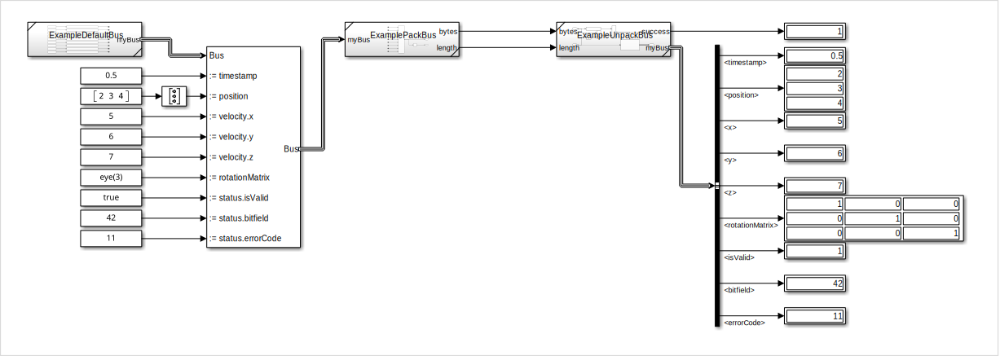

# Simulink Bus Serializer

This MATLAB package allows a Simulink bus to be converted into binary data and vice versa.
This makes it possible, for example, to transfer a bus via UDP.
Three subsystem reference models are generated on the basis of a given MATLAB struct.
These reference models define the bus and perform the serialization.

1. **Default Bus**: Has one output port that contains the bus definition. All values can be assigned afterwards using a Bus Assignment block. Use this subsystem to create the bus for later serialization.
2. **Pack Bus**: Serialize the bus into a set of bytes using the machine byte-order.
3. **Unpack Bus**: Deserialize binary data to reconstruct the bus. The subsystem outputs a boolean success signal, that is TRUE if the binary data has been unpacked successfully (e.g. length matches).

The subsystem reference models can then be used in a Simulink model.




## Getting Started
The repository is structured as a Simulink project.
Add the Simulink project (`BusSerializer.prj`) as a reference project to an existing Simulink project so that the MATLAB package appears in the project path.
Alternatively, add the `package` folder to the MATLAB path.


## How To Use
Create a MATLAB structure and run the `BusSerializer.StructToSubsystems()` function.

```
% example structure
s.value1       = 0;
s.value2       = uint8(0);
s.nested.value = zeros(2,4,'single');

% build subsystem reference models
BusSerializer.StructToSubsystems(s, 'exampleBus');
```

For more information, run `help BusSerializer.StructToSubsystems`.
An example is given in the [example](example) directory.

